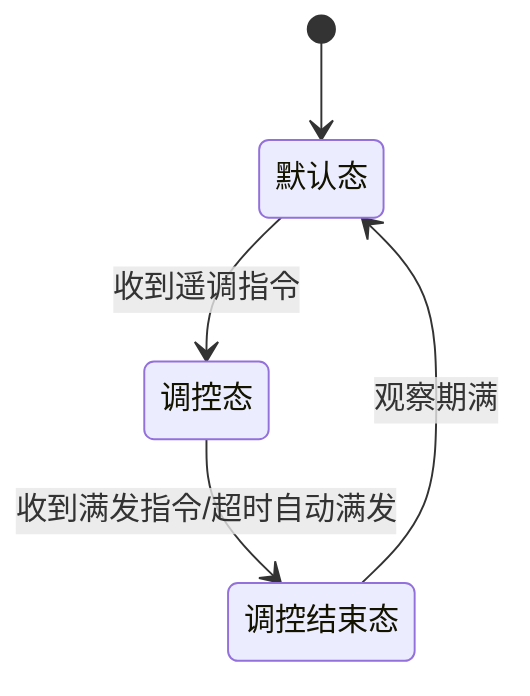

# 待处理事项
## ✅️给编辑区左侧加行号
软行号也就是逻辑行号：没有换行符的行算一行，有换行符的行算两行，以此类推
在编辑区输入内容时，行号会自动更新，与内容保持一致
## ✅️预览编辑来回切换标题行要对上，预览和编辑区内容滚动时左侧大纲选中行要跟着变
## ✅️去锁定、解锁按钮
## ✅️预览区双击进入编辑模式
## ✅️预览模式支持复制
## ✅️未保存关闭文件时提示是否保存
## ✅️预览模式图片支持打开文件位置
## ✅️编辑模式支持图片粘贴，并像typora一样可以指定文件保存位置
在顶部文件下加一个偏好设置，用户可以在偏好设置中指定图片保存位置

## ✅️快捷键不可用
ctrl+n 新建文件
ctrl+o 打开文件
ctrl+shift+e 切换预览/编辑模式
ctrl+shift+i 打开DevTools调试工具
ctrl+s 保存
ctrl+shift+s 另存为
ctrl+f 打开搜索框（回车切换到下一个匹配项、shift+回车切换到上一个匹配项、esc关闭搜索框）
ctrl+shift+f 打开替换框
ctrl+w 关闭当前文件
## ✅️G:\重装系统记录\记录.md读取乱码，使用typora打开正常显示，需要做兼容处理
## ✅️终端打印乱码处理
## ✅️大纲和内容需要加搜索功能（支持回车搜索）
## ✅️mermaid流程图没展示出来

## 加行号后编辑功能被影响