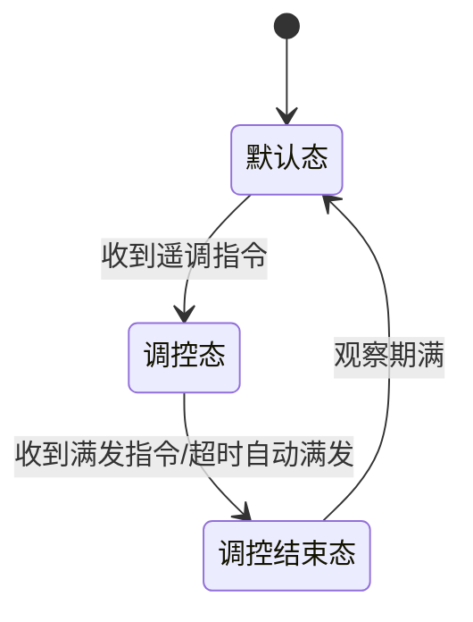

# 待处理事项
## 给编辑区左侧加行号
## ✅️预览编辑来回切换标题行要对上，预览和编辑区内容滚动时左侧大纲选中行要跟着变
## 大纲和内容需要加搜索功能
## mermaid图没展示出来

```mermaid
stateDiagram-v2
    [*] --> 默认态
    默认态 --> 调控态 : 收到遥调指令
    调控态 --> 调控结束态 : 收到满发指令/超时自动满发
    调控结束态 --> 默认态 : 观察期满
```