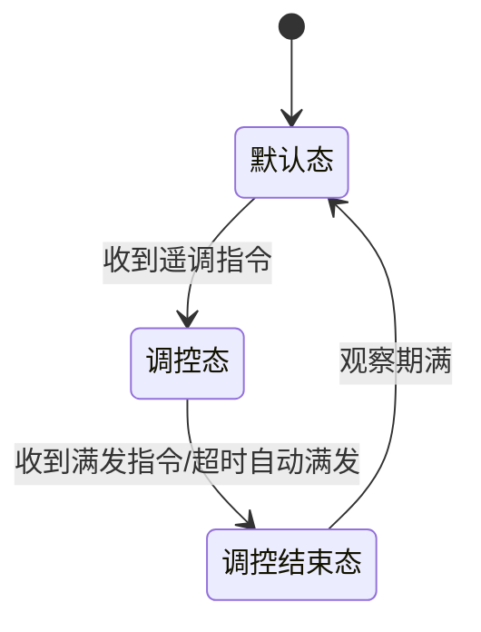

# 待处理事项
## 给编辑区左侧加行号
## ✅️预览编辑来回切换标题行要对上，预览和编辑区内容滚动时左侧大纲选中行要跟着变
## ✅️去锁定、解锁按钮
## ✅️预览区双击进入编辑模式
## ✅️预览模式支持复制
## 未保存关闭文件时提示是否保存
## 预览模式图片支持打开文件位置
## ✅️快捷键不可用
ctrl+n 新建文件
ctrl+o 打开文件
ctrl+shift+e 切换预览/编辑模式
ctrl+shift+i 打开DevTools调试工具
ctrl+s 保存
ctrl+shift+s 另存为

## 大纲和内容需要加搜索功能
## ✅️mermaid流程图没展示出来
