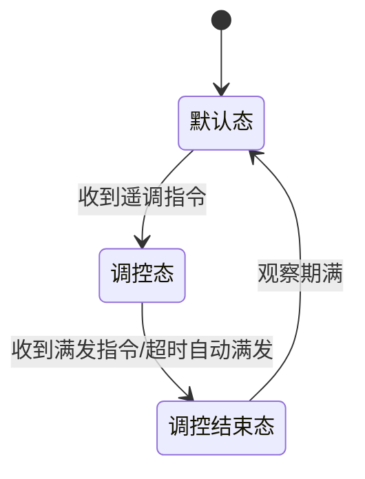

# 待处理事项
## ✅️给编辑区左侧加行号
软行号也就是逻辑行号：没有换行符的行算一行，有换行符的行算两行，以此类推
在编辑区输入内容时，行号会自动更新，与内容保持一致
## ✅️预览编辑来回切换标题行要对上，预览和编辑区内容滚动时左侧大纲选中行要跟着变
## ✅️去锁定、解锁按钮
## ✅️预览区双击进入编辑模式
## ✅️预览模式支持复制
## ✅️未保存关闭文件时提示是否保存
## ✅️预览模式图片支持打开文件位置
## ✅️偏好设置-图像
编辑模式支持图片粘贴，并像typora一样可以指定文件保存位置
在顶部文件下加一个偏好设置，用户可以在偏好设置中指定图片保存位置
## ✅️快捷键不可用
- ctrl+n 新建文件
- ctrl+o 打开文件
- ctrl+shift+o 打开文件夹
- ctrl+shift+e 切换预览/编辑模式
- ctrl+shift+i 打开DevTools调试工具
- ctrl+s 保存
- ctrl+shift+s 另存为
- ctrl+f 打开搜索框（回车切换到下一个匹配项、shift+回车切换到上一个匹配项、esc关闭搜索框）
- ctrl+h 打开替换框
- ctrl+w 关闭当前文件
- ctrl+, 打开偏好设置（逗号中英文都可以）
## ✅️G:\重装系统记录\记录.md读取乱码，使用typora打开正常显示，需要做兼容处理
## ✅️终端打印乱码处理
## ✅️大纲和内容需要加搜索功能（支持回车搜索）
## ✅️mermaid流程图没展示出来

## ✅️加行号后编辑功能被影响
## ✅️有些没大纲标题的文件中预览和编辑按钮会遮盖内容，或者标题或文本太长也会遮盖内容
## ✅️最近打开文件/已打开文件夹列表加右键功能（打开文件位置）
## ✅️文件和文件夹可以通过右键功能重命名
## ✅️文件夹应该带刷新功能，要不修改了或多了文件后不重新加载
## 预览模式也可以显示行号，与编辑区保持一致，可以在偏好设置加一个选项开启或关闭
## ✅️偏好设置中加一个快捷键选项，把当前支持的快捷键都列出来
## ✅️文件夹浏览中隐藏文件或文件夹不需要显示，可以在偏好设置中加一个选项显示或隐藏
## ✅️加版本号，软件自动、手动更新功能
我已经在github上建了一个仓库，用于存储软件的代码和发布版本
解决办法：
方法一：执行./publish.bat脚本
```shell
@echo off
set GH_TOKEN=你的github_personal_access_token
CALL ./build.bat
```
方法二：用户手动设置GH_TOKEN环境变量并执行build.bat脚本
```shell
set GH_TOKEN=你的github_personal_access_token
./build.bat
```
## ✅️重新打了包怎么还是老版本
解决办法：
- 先执行npm run build
- 再执行npm run make:win
## 打包后文件体积太大100多M，需要优化一下
## 国际化支持
## 集成agent功能
## 缺少Readme.md文件，总结软件的功能和使用方法
## ✅️ctrl+h 打开替换框功能不存在
## ✅️优化一下文件浏览侧边栏，现在效果不是很好
如果添加的文件夹过多会出现很长的滚动条
文件夹浏览、最近打开文件、已打开文件列表在侧边栏按照2:1:1的比例显示，超过部分可以滚动查看
## ✅️右键菜单也需要优化一下，弄小点
## 和typora一样打开文件时，自动加载文件文件所属文件夹的所有文件，用户可以在文件夹中切换文件
## ✅️未打开文件时，底部不应显示无标题文档，已保存，字数统计，阅读时间等信息
## ✅️未打开文件时不应该显示大纲
## 预览模式也支持编辑功能

